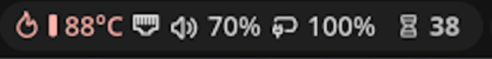
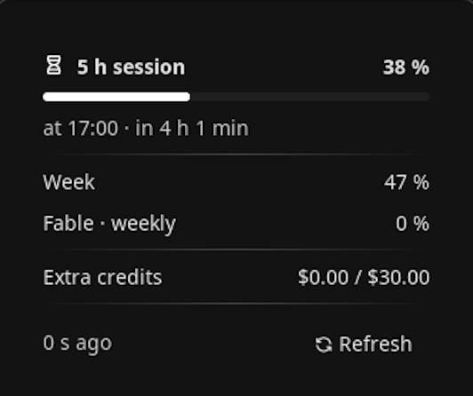
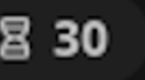
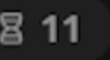
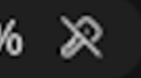
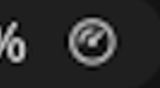

# noctalia-plugins

Plugins propios para [Noctalia](https://github.com/noctalia-dev) 5.

## claude-usage

El consumo de tu suscripción de Claude, en la barra.



La píldora enseña la **ventana de sesión de 5 h**: es la única que se recupera
esperando un rato, así que es sobre la que puedes actuar. La semanal no
desaparece — vive en el panel, que se abre con un clic.



El dato sale de la misma API que usa Claude Code (`/api/oauth/usage`), leyendo
las credenciales OAuth que ya tienes en `~/.claude/.credentials.json`. No hay
que configurar ninguna clave: si usas Claude Code, funciona.

### Qué pasa cuando algo falla

Un medidor que miente es peor que uno que falta. La regla es que **ningún error
deja un número en pantalla sin marcar de dónde viene**:

| | Estado | Qué significa |
|---|---|---|
|  | Normal | Dato recién consultado. |
|  | Atenuado | La API no responde. El número es el último bueno, y el panel dice si viene de memoria («Sin conexión · hace 8 min») o del disco («Caché local · hace 4 días»). |
|  | Sesión caducada | El token OAuth venció. Abre Claude Code para renovarlo. |
|  | Cargando | Primera consulta tras arrancar. |

Y si no hay credenciales que leer —o el fichero está corrupto— **el widget se
oculta entero** en vez de ocupar sitio para no decir nada.

El atenuado es opacidad sobre el mismo rol de color, no un rol distinto. Así el
matiz queda libre para la severidad, y las dos señales siguen distinguiéndose
cuando el dato es viejo **y** además estás cerca del límite.

Junto a la píldora aparece un pequeño círculo de aviso cuando una ventana que
**no** es la de la barra se acerca a su límite: con la sesión fija en la
píldora, es la única pista de que la semanal va mal sin abrir el panel.

### Instalación

Requiere **Noctalia 5** (Plugin API 12 o superior).

```bash
noctalia msg plugins source add daf3r git https://github.com/Daf3r/noctalia-plugins
noctalia msg plugins enable daf3r/claude-usage
```

Después, añade el widget `daf3r/claude-usage:meter` a un grupo de tu barra desde
los ajustes de Noctalia. Para quitarlo:

```bash
noctalia msg plugins disable daf3r/claude-usage
noctalia msg plugins source remove daf3r
```

El servicio es *headless* a propósito: quitar el widget de la barra **no** apaga
los avisos.

### Ajustes

| Ajuste | Por defecto | Qué hace |
|---|---|---|
| Umbral de aviso | 90 % | A partir de aquí una ventana se considera en aviso. |
| Intervalo en reposo | 300 s | Cada cuánto se consulta si nada está en aviso. |
| Intervalo en alerta | 60 s | Cada cuánto se consulta si algo lo está. |
| Mostrar sublímites por modelo | sí | La fila de tipo «Opus · semanal». |
| Mostrar créditos extra | sí | La fila de gasto adicional. |
| Mostrar restante | no | Enseña lo que queda en lugar de lo gastado. |

Ante fallos seguidos de la API el sondeo aplica *backoff*, con techo de 30 min.

### Idiomas

Español e inglés, siguiendo el idioma de tu shell. Las capturas de arriba están
en inglés porque es lo que tiene configurado la máquina donde se tomaron.

Añadir un idioma es un fichero en `claude-usage/translations/`: ningún texto de
cara al usuario está escrito en el código. La suite comprueba que los dos
catálogos tienen exactamente las mismas claves y que cada clave que produce la
lógica existe en ambos.

### Desarrollo

```bash
claude-usage/tests/run.fish
```

Necesita `luau`, `luau-analyze`, `luau-lsp` y `python3` en el `PATH` — el
intérprete de Luau no tiene `io` ni parsea JSON, así que los fixtures y las
traducciones se empaquetan antes como módulos. Además de la suite,
`run.fish` pasa el analizador estático, comprueba las entradas contra el fichero
de definiciones del SDK y ejecuta el linter propio de Noctalia.

`logic.luau` no llama a ninguna API del host, y por eso la suite corre sin
levantar el shell. Lo que sí depende del host —y ningún test puede ver— está
recorrido a mano en [`claude-usage/tests/MANUAL.md`](claude-usage/tests/MANUAL.md),
con lo observado en cada estado.

El diseño y las decisiones están en
[`docs/superpowers/specs/`](docs/superpowers/specs/).

## Licencia

MIT. Ver [LICENSE](LICENSE).
